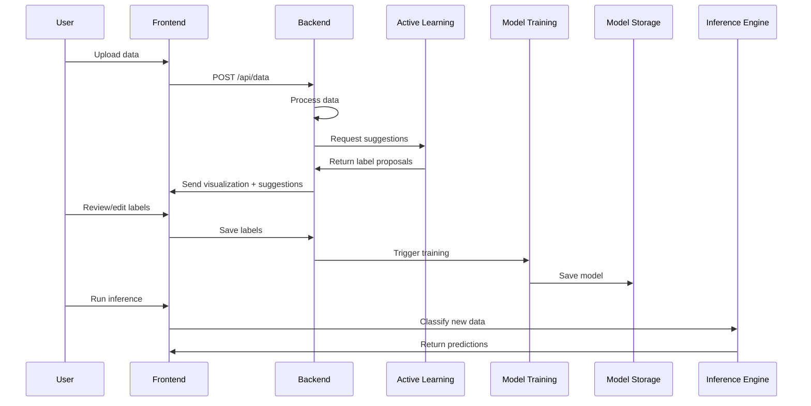

## Core Components

### Data Processing Pipeline
- CSV ingestion and validation
- Magnetic field data cleaning and normalization
- Feature extraction for ML
- Visualization data preparation

### Interactive Labeling System
- Visual selection tools (brush, lasso, polygon)
- Model-assisted labeling suggestions
- Label version control
- Real-time annotation preview

### Machine Learning Lifecycle
- Model training and validation
- Model registry with versioning
- Active learning for efficient annotation
- Transfer learning support

### Inference Engine
- Batch processing of new data
- Real-time classification
- Prediction visualization
- Result export capabilities

## Technology Stack
| Component | Technology | Version |
|-----------|------------|---------|
| Frontend | HTML, js, css | 18.3 |
| Visualization | d3.js | Latest |
| Backend | Django | 4.2 |
| ML Framework | TensorFlow | 2.15+ |
| Database | SQLite | 3.45 |
| Packaging | PyInstaller + Inno Setup | Latest |

all data files will be in the format of example\data_1.csv

